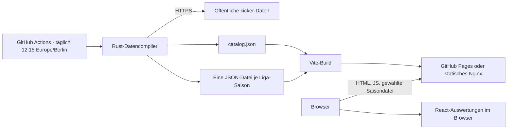

# Architektur

Punktespiegel ist eine statische Datenanwendung. Die Build-Pipeline sammelt und normalisiert öffentliche kicker-Daten; die ausgelieferte React-Anwendung liest nur versionierte JSON-Verträge aus demselben Website-Artefakt. Im Produktionsbetrieb laufen weder Rust noch PostgreSQL noch eine API.

## Systemkontext

## Komponenten

| Komponente | Verantwortung |
| --- | --- |
| `punktespiegel-data` | Quellverträge prüfen, historische Kaderzuordnung rekonstruieren und statische Snapshots schreiben |
| Saisonartefakte | Normalisierte Teams, Spieler, Spieltage, Spiele und Punkteaktionen einer Liga-Saison |
| `catalog.json` | Kleine Einstiegdatei mit Liga-, Saison-, Aktualitäts- und Mannschaftszugehörigkeitsmetadaten |
| React/Vite | Filter, Navigation, Tabellen, Detailseiten und sämtliche Aggregationen |
| GitHub Pages/Nginx | Unveränderte statische Dateien ausliefern |

## Datenvertrag

Jede Datei unter `frontend/public/data/seasons` enthält:

- Saison- und Spieltagsmetadaten,
- die in dieser Saison teilnehmenden Vereine,
- normalisierte Spielermetadaten einschließlich Position und Marktwert,
- alle Ligaspiele mit Ergebnis und Termin,
- pro Spieler und Spiel die Gesamtpunkte sowie Noten-, Tor-, Vorlagen-, Karten-, Startelf-, Zu-null-, SdS- und Joker-Anteile.

`schemaVersion` schützt den Browser vor inkompatiblen Artefakten. Der Generator lädt vorhandene abgeschlossene Saisons nur, wenn sie denselben Vertrag verwenden; andernfalls verlangt er ausdrücklich `--refresh-all`.

Der Katalog enthält außerdem je Liga-Saison die IDs der teilnehmenden Vereine sowie einen kompakten Spielerindex. Damit können Mannschafts- und Spielerprofile beim Saisonwechsel automatisch die damalige Liga wählen, ohne zunächst mehrere große Saisondateien laden zu müssen. Bei einem ligenübergreifenden Transfer innerhalb derselben Saison bleibt ein direkter Einstieg in die gewählte Liga erhalten; beim Wechsel aus einer anderen Saison wird der aktive beziehungsweise einsatzstärkste Saisonabschnitt gewählt.

Die Darstellung berechnet daraus deterministisch:

- kumulierte und einzelne Spieltagsranglisten,
- Mannschaftspunkte insgesamt und je Position,
- historische Toplisten,
- Spieler- und Mannschaftsdetailseiten,
- die punktstärkste reguläre Elf für Saison oder Spieltag,
- regelkonforme Classic- und Interactive-Kaderempfehlungen für die aktuelle Saison.

## Kaderprognose

Classic-v1 bleibt das deterministische Vergleichsmodell. Classic-v2 kombiniert dessen stabile Saisonprognose mit CatBoost-Spieltagresiduen und bewertet die positionsgebundene Reserve mit der vollständigen negativen wie positiven Punkteverteilung. Der Vorsaisonoptimierer teilt einen 15er-Septemberkader über mehrere latente Winterzustände und erlaubt je Zustand eine eigene regelkonforme Antwort mit höchstens drei positions- und slotgleichen Wechseln. Im echten Winterlauf werden der gekaufte Kader gesperrt, aktuelle Saisonzustände bis zum Cutoff eingespielt und nur die verbleibenden Spieltage optimiert.

Interactive-v2 nutzt die vollständigen Spieler-Spiel-Daten. Ein chronologisch trainierter CatBoost-Klassifikator schätzt DNP, Einwechslung und Startelf; nach Position und Rolle getrennte Regressoren schätzen bedingten Mittelwert sowie P10, Median und P90. Spieler mit wenig Historie werden zu einem aus Position, Liga und Preisstufe gelernten empirischen Prior zurückgezogen. Das nachgelagerte HiGHS-Modell besitzt einen September- und einen Winterkader, die saisonabhängige Zahl positionsgleicher Winterwechsel sowie eigene Aufstellungs- und Formationsentscheide für jeden Spieltag. In beiden Kaderphasen bildet es eine Torwartversicherung aus drei Spielern desselben Vereins. Seine Hauptzielfunktion ist die Summe der erwarteten Punkte der jeweils besten gültigen Elf, nicht eine feste Startelf mit pauschalem Bankabschlag.

Vor dem finalen Interactive-Training wird das Mischgewicht auf einer früheren Vorsaison festgelegt. Eine zeitlich spätere Saison dient als Champion-/Challenger-Gate. Classic verwendet mehrere Rolling-Origin-Folds und gibt dem v1-Vergleich dieselbe legale Winteraktion. Die historischen Saisonartefakte enthalten jedoch noch keine nachweislichen Entscheidungszeit-Snapshots für Preis, Vereinszuordnung, `active` und `selectable`. Beide Validierungen werden deshalb als experimentell gekennzeichnet und nicht als leakage-sicher ausgegeben. Danach wird das Produktionsmodell mit allen abgeschlossenen Saisons neu trainiert.

Beide Verfahren erzeugen statische JSON-Dateien für Bundesliga, 2. Bundesliga und 3. Liga. Der Browser lädt nur das zur Auswahl passende Ergebnis und führt weder Modelltraining noch Kaderoptimierung aus. Details stehen unter [Classic-v2](classic-v2.md) und [Interactive-v2](interactive-v2.md).

In der Produktion wird der Zustand aller abgeschlossenen Spiele der laufenden Saison vor der Prognose wiederhergestellt. Die tatsächlichen Rollen aktualisieren die künftige Einsatzverteilung mit abklingendem Gewicht; bekannte Punkte und Rollen ersetzen die Darstellung bereits gespielter Runden exakt. Für die Optimierung erhalten diese Runden jedoch den Wert null, sodass die Empfehlung nur verbleibende Punkte maximiert. `recommendation.currentSeasonEvidence` dokumentiert Cutoff, Beobachtungsumfang und Beginn des Optimierungsfensters.

Die ausgegebenen Punkte sind Erwartungswerte und werden im UI ausdrücklich als Prognose gekennzeichnet. Das Verfahren nutzt keine privaten Managerdaten und behauptet nicht, den späteren Siegerkader sicher vorherzusagen.

## Nachrichten

Der Datencompiler liest serverseitig im täglichen Build mehrere öffentliche RSS-Feeds. Eine statische `news.json` ordnet jedem Spieler höchstens zehn Treffer der letzten 14 Tage mit Datum, Quelle, Überschrift und Link zu. Der Browser kommuniziert nicht direkt mit den Quellen. Ein fehlgeschlagener Nachrichtenlauf ersetzt keinen vorhandenen Stand; ein optionaler NewsAPI-Schlüssel bleibt ein Actions-Secret.

Für die aktuelle Bundesliga ergänzt `current-role-signals.json` einen lokal erzeugten LigaInsider-Snapshot: Topelf/Alternativen, direkte Spieler- und Vereinslinks sowie aktuelle Vereinsthemen. `current-availability-signals.json` trennt davon den aktuellen medizinischen Status. LigaInsider liefert Verletzungen, Aufbautraining, Sperren und Nichtberücksichtigung für die Bundesliga; die öffentlichen Transfermarkt-Ausfalllisten decken die 2. Bundesliga und 3. Liga ab. Der medizinische Status hat in der Produktionsoptimierung Vorrang vor der Saisonhierarchie. Beide Stände und die daraus erzeugten Empfehlungen werden lokal erstellt, gemeinsam eingecheckt und vom Browser ausschließlich als statische Dateien geladen.

`external-performance-benchmark.json` enthält zusätzlich den LigaInsider-Leistungsindex 2025/26 als unabhängigen Bundesliga-Rangbenchmark gegen die kicker-Historie. Wegen der unterschiedlichen Punktesysteme fließt er nicht als weiteres Punktemerkmal in den Optimierer ein; er dient als überprüfbarer Plausibilitäts- und Abdeckungstest.

## Sharding und Übertragung

Die Daten sind nach Liga-Saison statt nach der gesamten Historie geshardet. Ein Seitenaufruf lädt zunächst den Katalog mit dem Profilindex und anschließend genau die ausgewählte Saison. Der Katalog ist unkomprimiert ungefähr 590 KB und per HTTP-Gzip etwa 66 KB groß. Die Saisondateien sind unkomprimiert ungefähr 4–5 MB groß, werden durch HTTP-Gzip wegen der wiederholten Feldnamen aber typischerweise auf etwa 180–250 KB reduziert. Ein Wechsel innerhalb derselben Saison nutzt den Browsercache.

Noch feinere Spieler- oder Spieltagsshards würden die Zahl der Netzwerkanfragen und die Komplexität der Navigation erhöhen, ohne für diesen Datenumfang einen messbaren Vorteil zu bringen.

## Aktualisierungsmodell

Abgeschlossene Spieltage sind fachlich unveränderliche Snapshots. Der tägliche Standardlauf:

1. übernimmt vollständig abgeschlossene Saisons aus dem Repository,
2. lädt die laufende Saison für jede unterstützte Liga,
3. lädt nur Spieltage, deren Endzeit bereits erreicht ist,
4. schreibt die Saisondatei atomar in den Build-Arbeitsbereich,
5. baut und veröffentlicht ein einziges konsistentes Pages-Artefakt.

Eine unvollständige Vorsaison wird nach dem Saisonwechsel weiter aktualisiert, bis alle Spieltage vorhanden sind. Korrekturen an älteren Saisons werden über einen manuellen `--refresh-all`-Lauf bewusst und überprüfbar eingespielt.

## Konsistenz und Fehlerverhalten

- Ein fehlgeschlagener Datenbuild erreicht den Deployment-Job nicht; das vorige Pages-Artefakt bleibt aktiv.
- Quelldaten werden vor dem Schreiben des Katalogs vollständig deserialisiert und normalisiert.
- `null` in numerischen kicker-Feldern wird ausschließlich dort als `0` interpretiert, wo der Quellvertrag dies zulässt.
- Historische Vereinszugehörigkeiten werden aus den tatsächlichen Spieleinsätzen rekonstruiert, weil ältere Saisonstammdaten aktuelle Kader enthalten können.
- Stabile Quell-IDs verbinden Spieler, Vereine, Spiele und Wertungen; Namen dienen nie als Schlüssel.

## Grenzen

- Neue Filter oder Auswertungen müssen mit den Feldern des statischen Vertrags auskommen oder einen neuen Datenbuild erhalten.
- Auf sehr alten Geräten kostet die erstmalige JSON-Dekompression und Aggregation einer Saison etwas CPU und Speicher.
- Spielerfotos und Vereinslogos werden weiterhin von öffentlichen kicker-Mediendiensten geladen; ihr Ausfall beeinträchtigt nur Bilder, nicht die Wertungen.
- Es gibt keine serverseitige Volltextsuche oder nutzerspezifische Zustände. Das entspricht dem öffentlichen Dashboard-Zweck.
