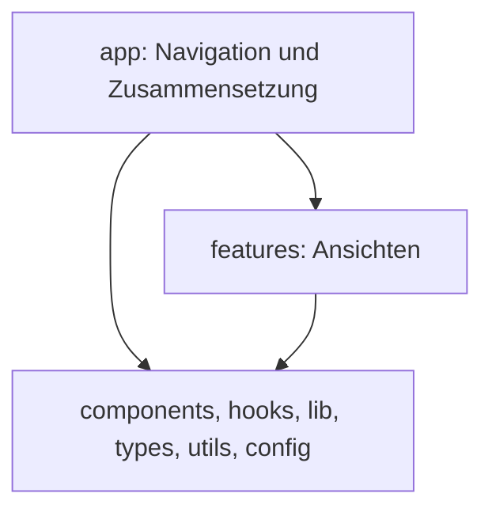
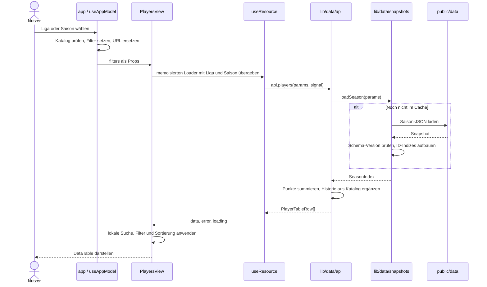

# React-Frontend

Die Anwendung ist nach Funktionen gegliedert. `app` verbindet die Ansichten;
`features` enthalten deren Darstellung und lokalen Zustand; gemeinsame Module
laden Daten und berechnen die angezeigten Werte. Einstieg zum Lesen:
[app.tsx](../frontend/src/app/app.tsx), danach die interessierende Feature-Ansicht.

Die Struktur folgt den
[Feature-Grenzen von Bulletproof React](https://github.com/alan2207/bulletproof-react/blob/master/docs/project-structure.md).
Die [Architekturentscheidung](adr/0002-frontend-feature-boundaries.md) erklärt,
warum wir React, den bestehenden Snapshot-Cache und die Navigation beibehalten.
Die [Systemarchitektur](architecture.md) beschreibt Import und Veröffentlichung.

## Verzeichnisse und Zuständigkeiten

```text
frontend/
  src/
    main.tsx                 React StrictMode, Fonts und globale Styles
    app/
      app.tsx                AppShell, Filter und Zusammensetzung der Ansichten
      use-app-model.ts       Navigation, Katalog, Saisonwahl und Rücksprung
      navigation.ts          Auswahlregeln für Liga-, Vereins- und Spielersaisons
      navigation-items.tsx   Navigationsbeschriftungen und Icons
      use-page-metadata.ts   Titel, Canonical-URL und strukturierte Daten
      site-footer.tsx        Footer mit Navigation
    features/
      standings/             Überblick: Ligatabelle, Form, Verlauf, Kreuztabelle
      rankings/              Tabellen: Managerpunkte, Ranglisten und beste Elf
      matchday/              Ergebnisse und kompakter Spieltagsbericht
      matches/               Einzelner Spielbericht mit Aufstellungen
      players/               Spielerliste und Spielerprofil mit Karriere und News
      teams/                 Mannschaftsliste, Kader, Transfers und Saisonverlauf
      info/                  Über, Methodik, Quellen und FAQ
    components/              Gemeinsam genutzte Fußball- und Seitenkomponenten
    hooks/use-resource.ts    Ladezustand und Lebenszyklus einer Datenabfrage
    lib/
      navigation/            Pfade, URL-Parameter und gemeinsame Filtertypen
      data/                  Snapshot-Zugriff und fachliche Berechnungen
      resource.ts            Ergebnisveröffentlichung und Abbruchschutz
      abortable.ts           Abbruch eines einzelnen Cache-Konsumenten
    types/models.ts          Gemeinsam genutzte Darstellungsmodelle
    config/site.ts           Website-URL und gemeinsame FAQ-Inhalte
    utils/                   Formatierung und kleine gemeinsame Hilfsfunktionen
    styles.css               Projektweite Gestaltung auf Basis von fun-ui
  testing/architecture.test.mjs  Import-Grenzen und Zyklenprüfung
  public/data/               Generierte JSON-Dateien, keine Frontend-Quelldateien
```

Eine Feature-Datei darf andere Dateien desselben Features und gemeinsame Module
importieren. Sie darf weder `app` noch ein anderes Feature importieren. Gemeinsame
Module dürfen keine Features und keine App-Dateien importieren. `app` komponiert
die Features und reicht Navigation als Callbacks weiter. Direkte Dateiimporte
machen die Abhängigkeiten sichtbar; es gibt keine Barrel-Dateien.



Die Pfeile zeigen erlaubte Importabhängigkeiten. `npm test --workspace frontend`
prüft diese Grenzen und verbietet Importzyklen, einschließlich Typimporten.

`@gruberb/fun-ui` liefert generische UI-Bausteine wie Tabellen, Popovers und die
AppShell. `components` ergänzt projektspezifische Bausteine wie Spielerporträts
und Spielkacheln. Eine nur im Spielerprofil verwendete Karriereansicht bleibt
dagegen in `features/players`.

## Datenfluss vom Klick zur Darstellung



Der Browser verwendet keine laufende Backend-API. `api` ist der typisierte
Einstieg in den lokalen Datenadapter. Nur `snapshots.ts` lädt JSON-Dateien per
`fetch`; die Modelle entstehen im Browser.

| Modul in `lib/data` | Aufgabe |
| --- | --- |
| `api.ts` | Öffentliche Abfragen: Katalog, Spieler, Mannschaften, Tabellen, Spiele, beste Elf und Spieltagstexte |
| `snapshots.ts` | URLs, HTTP-Fehler, Promise-Caches, optionale Dateien, Saisonindizes |
| `contracts.ts` | Typen der gespeicherten Artefakte und des internen `SeasonIndex` |
| `scoring.ts` | Punkteaggregation, Ranglisten, Mannschaftswertungen und beste Elf |
| `standings.ts` | Reine Tabellen-, Form- und Kreuztabellenberechnungen |
| `match-models.ts` | Darstellungsmodelle für Ligatabelle und einzelne Spiele |
| `player-models.ts` | Spielerprofil, Spiele, Saisongeschichte und externe Ergänzungen |
| `team-models.ts` | Mannschaftsprofil, Kader und mögliche Startelf |
| `player-table.ts` | Historische Spieleranalyse und Sortierung |
| `news.ts`, `kicker-links.ts` | Nachrichtenbezug, Quellenangaben und verifizierte Verlinkung |
| `rounds.ts` | Verfügbare Spieltage und zuletzt gespielte Saison |

Beim Öffnen eines Spielerprofils ruft die Liste `onPlayer(id)` auf. Die App
speichert den bisherigen Ort mit Scrollposition, setzt die Spieler-ID und
schreibt die URL. Der Katalog bestimmt, in welcher Liga der Spieler in der
gewählten Saison vertreten ist. Erst nach dieser Auflösung lädt
`PlayerDetailView` mit `api.player` das Profil. Dessen Saisongeschichte kann
zusätzliche Saisondateien laden, in denen dieser Spieler vertreten war.
Der Zurück-Button stellt den gespeicherten Ort und die Scrollposition wieder her.

## Wem gehört welcher Zustand?

| Zustand | Eigentümer | Lebensdauer |
| --- | --- | --- |
| Liga, Saison, Spieltag, Ansicht und Detail-IDs | `useAppModel` | Solange die App geöffnet ist; relevante Werte stehen zusätzlich in der URL |
| Spieler-Spaltenmodus | `useAppModel` | In der URL als `columns=history` teilbar |
| Rücksprungorte und Scrollpositionen | `useAppModel` | Interner Stapel; Hauptnavigation leert ihn |
| Suchtext, Positionsfilter, Sortierung, Profil-Tab | jeweilige Feature-Komponente | Lokaler React-Zustand; beim Unmount verworfen |
| Geladene Daten, Ladezustand und Fehler | `useResource` je Abfrage | Bis Loaderwechsel oder Unmount |
| Heruntergeladene Snapshots | `snapshots.ts` | Promise-Cache für die gesamte Seitenladung |
| Abgeleitete Tabellen und Summen | Datenadapter beziehungsweise Feature | Aus den Eingaben berechnet, kein zusätzlicher globaler Store |

Die URL wird mit `history.replaceState` synchronisiert. Der interne
Zurück-Button ist deshalb kein Browser-History-Router. Browser-Zurück erzeugt
keine Navigation zwischen allen vorherigen App-Auswahlen. Dieses bestehende
Verhalten wurde bei der Umstrukturierung beibehalten.

Die sichtbaren Namen unterscheiden sich teilweise von alten Route-IDs:
`overview` auf `/` zeigt die Ligatabelle (`standings`), während `table` auf
`/tabelle` Manager-Ranglisten (`rankings`) zeigt. Die alten Links bleiben gültig.
Pfade und Legacy-Aliase stehen in `lib/navigation/routes.ts`; der Vite-Build
schreibt dazu statische HTML-Einstiegspunkte.

## Laden, Abbruch und Fehler

Jede Ansicht übergibt `useResource` einen mit `useCallback` stabilisierten
Loader. Alle Eingaben, die das Ergebnis ändern, gehören in dessen Dependency-Liste:

```tsx
const { data, error, loading } = useResource(useCallback(
  (signal: AbortSignal) => api.players(new URLSearchParams({ league, season }), signal),
  [league, season],
));
```

Bei einem Loaderwechsel zeigt der Hook sofort einen leeren Ladezustand. Cleanup
bricht den bisherigen Konsumenten ab. Auch ein Loader, der das Signal ignoriert,
darf nach dem Abbruch weder Daten noch Fehler noch einen beendeten Ladezustand
veröffentlichen. `null` als Loader deaktiviert eine Abfrage.

Der zugrunde liegende Download darf weiterlaufen: Andere Ansichten können
dasselbe Promise verwenden. `abortable` bricht nur das Warten des jeweiligen
Konsumenten ab. Die Lösung funktioniert auch mit dem zusätzlichen Effect-Cleanup
von React StrictMode.

| Fall | Verhalten |
| --- | --- |
| Katalog oder benötigte Saison fehlt | Fehleransicht statt unvollständiger Pflichtdaten |
| Saison hat eine unbekannte `schemaVersion` | Datenadapter lehnt die Datei ab |
| Spieler, Verein oder Spiel fehlt | Klarer Fehler aus dem jeweiligen Modell |
| Spieltag liegt außerhalb der Saison | `selectedRound` lehnt die Abfrage ab |
| Spieltagstexte fehlen | Tabelle bleibt nutzbar; Karten entfallen |
| Profil- oder Karriere-Snapshot fehlt | Saisondatei, danach Legacy-Datei als Fallback; fehlender Zusatzblock entfällt |
| News-Datei fehlt | Nachrichtenmodell zeigt den fehlgeschlagenen Datenstand |
| Keine vollständige beste Elf möglich | Ranglistenkarte zeigt den Hinweis; optionaler Spieltagsblock entfällt |

Es gibt keine automatische Wiederholung oder zeitbasierte Cache-Invalidierung.
Auch fehlgeschlagene Saison-Promises und optionale Fallbacks bleiben bis zum
Neuladen gespeichert. Die bestehenden Artefakt-Typen sind keine vollständige
Laufzeitvalidierung: Der Generator prüft die Daten, der Browser prüft bei Saisons
zusätzlich die Schema-Version. Eine neue externe Datenquelle benötigt eine
passende Prüfung an ihrer Eingangsgrenze.

## Eine Änderung einbauen

1. **Darstellung ändern:** Die betreffende Feature-Komponente bearbeiten. Einen
   Baustein erst nach `components` verschieben, wenn mehrere Features ihn nutzen.
2. **Berechnung ändern:** Die gemeinsame Funktion in `lib/data` ändern und den
   fachlichen Grenzfall in der benachbarten `.test.ts` abdecken. Komponenten
   erhalten fertige Darstellungsmodelle statt eigene Snapshot-Parser.
3. **Abfrage ergänzen:** Laden und Cache in `snapshots.ts`, fachliche Ableitung im
   passenden Datenmodul, öffentlicher Einstieg in `api.ts`. Die Ansicht verwendet
   `useResource` und entscheidet über Pflichtfehler oder optionale Inhalte.
4. **Ansicht ergänzen:** Feature anlegen, in `app.tsx` zusammensetzen, Navigation
   und Metadaten ergänzen. Für einen neuen Pfad auch `routes.ts`, Routentests und
   die statischen Einstiegspunkte in `vite.config.ts` aktualisieren.
5. **Prüfen:** Vom Repository-Stamm aus ausführen:

```bash
npm test --workspace frontend
npm run typecheck
npm run build
```

Die bestehende CI führt diese Prüfungen aus. Tests liegen neben dem geprüften
Modul; der Testbefehl findet sie rekursiv. Die Architekturprüfung verwendet den
bereits installierten TypeScript-Parser und benötigt keine weitere Abhängigkeit.
Im Browser zusätzlich Einstieg per URL, Filterwechsel, Liste zu Detail und
Zurück sowie den betroffenen Fehler- oder Leerzustand prüfen.
